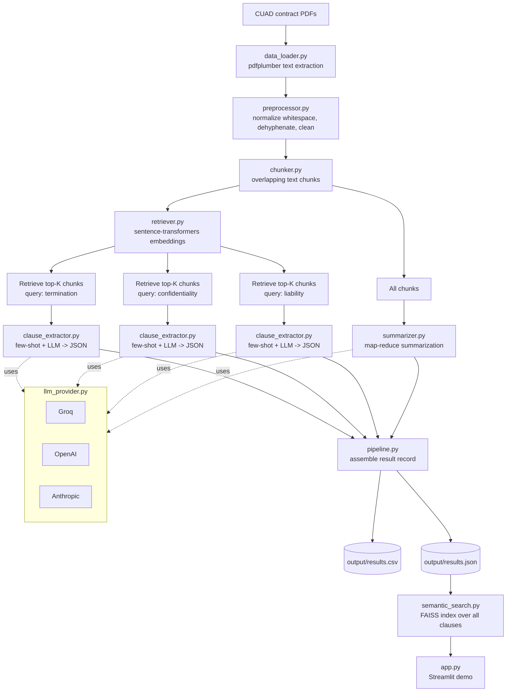

# Contract Clause Extraction & Summarization Pipeline

An LLM-powered pipeline that reads legal contracts (PDF), extracts three key
clause types (**termination**, **confidentiality**, **liability**), and
generates a structured summary — built on the [CUAD](https://www.atticusprojectai.org/cuad)
(Contract Understanding Atticus Dataset) clause taxonomy.

Built for the take-home assignment: *Document Processing with LLMs*.

---

## Why this design

A naive approach — "paste the whole contract into an LLM and ask it for
clauses" — breaks down fast: contracts run 2–80 pages, blowing context
windows and burning tokens on irrelevant boilerplate, and unstructured LLM
prose is painful to turn into a clean CSV. This project instead uses a small
**retrieval-augmented pipeline**:

1. Extract & normalize text from the PDF.
2. Split it into overlapping chunks and embed them.
3. For each clause type, **retrieve only the chunks semantically relevant to
   that clause** (e.g. querying for "termination, notice period, expiration"
   before asking about termination conditions) instead of sending the whole
   contract.
4. Ask the LLM to extract structured JSON from just those chunks, primed
   with a few-shot example.
5. Summarize via **map-reduce**: summarize each chunk, then combine into one
   100–150 word summary — so summary quality doesn't degrade on long
   contracts.

This keeps every LLM call small, fast, cheap, and grounded in the actual
retrieved text (less hallucination risk than "ctrl+f the whole document into
the prompt").

## Flow diagram



## Project structure

```
cuad-clause-extraction/
├── main.py                    # CLI entry point — run the full batch pipeline
├── compare_models.py          # Bonus: side-by-side model comparison
├── app.py                     # Optional Streamlit demo (upload PDF + semantic search)
├── src/
│   ├── config.py              # All tunables in one place
│   ├── data_loader.py         # PDF -> raw text (Task 1)
│   ├── preprocessor.py        # Text normalization (Task 1)
│   ├── chunker.py             # Sliding-window chunking
│   ├── retriever.py           # Embedding-based chunk retrieval
│   ├── llm_provider.py        # Groq / OpenAI / Anthropic abstraction + retries
│   ├── clause_extractor.py    # Part A — clause extraction
│   ├── summarizer.py          # Part B — map-reduce summarization
│   ├── semantic_search.py     # Bonus — FAISS search over extracted clauses
│   └── pipeline.py            # Orchestrates everything, writes CSV/JSON
├── prompts/
│   └── few_shot_examples.py   # Bonus — few-shot examples per clause type
├── scripts/
│   └── download_cuad.py       # Downloads CUAD v1 + builds a 50-contract sample
├── tests/                     # Unit tests (mocked LLM calls, no API key needed)
├── data/                      # CUAD dataset goes here (git-ignored)
└── output/                    # results.csv / results.json land here
```

## Setup

```bash
git clone <this-repo>
cd cuad-clause-extraction
python -m venv venv
source venv/bin/activate        # Windows: venv\Scripts\activate
pip install -r requirements.txt

cp .env.example .env
# edit .env and add at least one API key (GROQ_API_KEY recommended — free & fast)
```

Get a free Groq API key at https://console.groq.com/keys (used by default).

## Get the data

```bash
python scripts/download_cuad.py --sample 50
```

Downloads CUAD v1 from Zenodo and copies 50 contracts into
`data/full_contract_pdf_sample/`. If the automated download is blocked on
your network, see `data/README.md` for manual download instructions.

## Run the pipeline

```bash
# Smoke test on 5 contracts first
python main.py --data-dir data/full_contract_pdf_sample --limit 5

# Full assignment run — 50 contracts
python main.py --data-dir data/full_contract_pdf_sample --limit 50
```

Outputs land in `output/results.csv` and `output/results.json`. A hand-crafted
`output/sample_output.csv` / `.json` is included so you can see the exact
expected format without running the pipeline first.

Re-running is cheap: per-contract results are cached in `.cache/`, so only
new or previously-failed contracts trigger fresh LLM calls (use `--no-cache`
to force a clean run).

## Run the interactive demo (optional)

```bash
streamlit run app.py
```

Upload any contract PDF and see extraction + summary live, or semantic-search
across everything `main.py` has already processed.

## Bonus: semantic search

```python
from src.semantic_search import ClauseSearchIndex

index = ClauseSearchIndex.from_results_json("output/results.json")
for hit in index.search("what happens if a payment is missed", k=5):
    print(hit.contract_id, hit.clause_type, hit.score)
```

## Bonus: model comparison

```bash
python compare_models.py --data-dir data/full_contract_pdf_sample --limit 5 \
    --provider-a groq --model-a llama-3.3-70b-versatile \
    --provider-b openai --model-b gpt-4o-mini
```

Reports per-contract latency and clause-text agreement between two
providers — written to `output/model_comparison.csv`.

## Tests

```bash
pytest tests/ -v
```

All 21 tests run against mocked LLM providers and a fake retriever, so they
run in under a second with **no API key and no network access required**.

## Design decisions worth calling out

| Decision | Reasoning |
|---|---|
| Retrieval before extraction, not "dump whole contract" | Keeps prompts small, cheap, and grounded; scales to 80-page contracts without truncation |
| Structured JSON output, parsed defensively | CSV/JSON deliverables need clean fields, not prose to regex out |
| Provider abstraction (Groq/OpenAI/Anthropic) | One-line swap for cost/quality experiments; satisfies the "model comparison" bonus |
| Map-reduce summarization | 100–150 word summaries stay accurate even when the source is 40 pages |
| Per-contract disk cache | Re-running after a prompt tweak doesn't re-bill/re-wait on already-processed contracts |
| Errors isolated per-contract | One malformed PDF or one LLM hiccup doesn't kill a 50-contract batch run |
| Few-shot examples per clause type | Concretely improves extraction consistency and format adherence |

## Known limitations

- Extraction quality depends on the underlying LLM; smaller/free models may
  occasionally miss nuanced carve-outs or exceptions within a clause.
- Scanned/image-only PDFs (no text layer) are skipped rather than OCR'd —
  CUAD's contracts are almost all text-based, so this wasn't needed here,
  but would be the natural next step (e.g. via `pytesseract`).
- `key_terms` fields are best-effort structured extras, not guaranteed to be
  present for every contract — treat `clause_text` as the reliable field.
