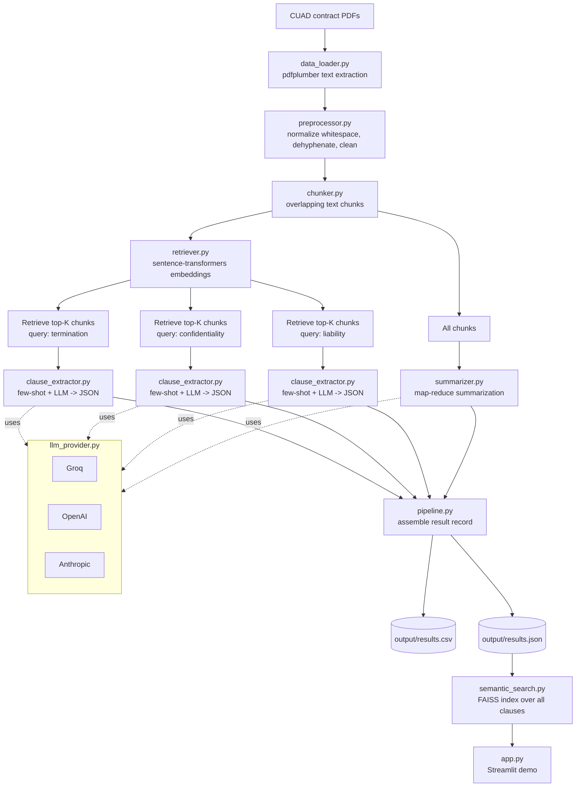

[](https://karthiks-cuad-clause-extraction.streamlit.app)
## 🔗 Live demo:
[karthiks-cuad-clause-extraction.streamlit.app](https://karthiks-cuad-clause-extraction.streamlit.app)


# Contract Clause Extraction & Summarization Pipeline

An LLM-powered pipeline that reads legal contracts (PDF), extracts three key
clause types (**termination**, **confidentiality**, **liability**), and
generates a structured summary — built on the [CUAD](https://www.atticusprojectai.org/cuad)
(Contract Understanding Atticus Dataset) clause taxonomy.

Built for the AI Intern take-home assignment: *Document Processing with LLMs*.

---

## Quick start

```bash
git clone <this-repo> && cd cuad-clause-extraction
py -3.12 -m venv venv && source venv/bin/activate   # Windows: venv\Scripts\activate
pip install -r requirements.txt
cp .env.example .env   # add a GROQ_API_KEY (free at console.groq.com/keys)

python scripts/download_cuad.py --sample 50        # real CUAD data, 50 contracts
python main.py --data-dir data/full_contract_pdf_sample --limit 50
```

Outputs land in `output/results.csv` and `output/results.json` — and an
**accuracy check against CUAD's own expert gold labels prints automatically**
right after the batch finishes (see [Accuracy](#accuracy) below). See
[Troubleshooting](#troubleshooting) if the first run fails with a `proxies`
TypeError — it's a one-line fix.

---

## Why this design

A naive approach — "paste the whole contract into an LLM and ask for
clauses" — breaks down fast: contracts run 2–80 pages, blowing context
windows and burning tokens on boilerplate, and unstructured LLM prose is
painful to turn into a clean CSV. This project instead uses a small
**retrieval-augmented pipeline**:

1. Extract & normalize text from the PDF.
2. Split it into overlapping chunks and embed them.
3. For each clause type, **retrieve only the chunks semantically relevant to
   that clause** (e.g. querying "termination, notice period, expiration"
   before asking about termination conditions) instead of sending the whole
   contract.
4. Ask the LLM to extract structured JSON from just those chunks, primed
   with a few-shot example.
5. Summarize via **map-reduce**: summarize each chunk, then combine into one
   100–150 word summary — so summary quality doesn't degrade on long
   contracts.

Every LLM call stays small, fast, cheap, and grounded in the actual
retrieved text.

## Flow diagram



A more detailed **sequence diagram** (exact function call order) and
**decision flowchart** (cache/error-handling logic) are in
[`docs/execution_diagrams.md`](docs/execution_diagrams.md). A **draw.io**
version of the architecture (exportable to PNG/SVG for slides) is in
[`docs/architecture.drawio`](docs/architecture.drawio) — open at
[app.diagrams.net](https://app.diagrams.net).

## Project structure

```
cuad-clause-extraction/
├── main.py                       # CLI entry point — runs the pipeline, then auto-prints an accuracy check
├── compare_models.py             # Bonus: side-by-side model comparison
├── app.py                        # Streamlit demo (upload PDF + semantic search)
├── demo_pipeline_walkthrough.ipynb  # Executed notebook demo — real CUAD data, cell-by-cell, incl. accuracy step
├── src/
│   ├── config.py                 # All tunables in one place
│   ├── data_loader.py            # PDF -> raw text (Task 1)
│   ├── preprocessor.py           # Text normalization (Task 1)
│   ├── chunker.py                # Sliding-window chunking
│   ├── retriever.py              # Embedding-based chunk retrieval
│   ├── llm_provider.py           # Groq / OpenAI / Anthropic abstraction + retries
│   ├── clause_extractor.py       # Part A — clause extraction
│   ├── summarizer.py             # Part B — map-reduce summarization
│   ├── semantic_search.py        # Bonus — FAISS search over extracted clauses
│   └── pipeline.py               # Orchestrates everything, writes CSV/JSON
├── prompts/
│   └── few_shot_examples.py      # Bonus — few-shot examples per clause type
├── scripts/
│   ├── download_cuad.py          # Downloads full CUAD v1 + builds a 50-contract sample
│   ├── prepare_demo_contracts.py # Builds the small real-data demo set (no big download)
│   └── evaluate_accuracy.py      # Scores extractions against CUAD's gold labels (used by main.py)
├── docs/
│   ├── execution_walkthrough.md  # Step-by-step trace of the real call stack, with code
│   ├── execution_diagrams.md     # Sequence diagram + decision flowchart (Mermaid)
│   └── architecture.drawio       # Editable system diagram (draw.io / diagrams.net)
├── tests/                        # 21 unit tests (mocked LLM calls, no API key needed)
├── data/
│   └── demo_contracts/           # 6 REAL CUAD contracts, bundled, ready to run offline
└── output/                       # results.csv, results.json, accuracy_report_<label>.csv land here
```

## Setup

```bash
python -m venv venv
source venv/bin/activate        # Windows: venv\Scripts\activate
pip install -r requirements.txt
cp .env.example .env
# edit .env and add at least one API key (GROQ_API_KEY recommended — free & fast)
```

Get a free Groq API key at https://console.groq.com/keys (used by default).

## Get the data

**Option A — instant, real data, zero download.** The repo already includes
`data/demo_contracts/`: 6 real CUAD contracts (genuine SEC-filing text,
sourced from the official CUAD GitHub release) rendered to PDF. Good for a
quick smoke test:

```bash
python main.py --data-dir data/demo_contracts --limit 6
```

**Option B — the full 50-contract assignment run:**

```bash
python scripts/download_cuad.py --sample 50
python main.py --data-dir data/full_contract_pdf_sample --limit 50
```

This downloads CUAD v1 from Zenodo and copies 50 contracts into
`data/full_contract_pdf_sample/`. If the automated download is blocked on
your network, see [`data/README.md`](data/README.md) for manual steps.

## Run the pipeline

```bash
# Smoke test first
python main.py --data-dir data/demo_contracts --limit 6

# Full assignment run
python main.py --data-dir data/full_contract_pdf_sample --limit 50
```

A hand-crafted `output/sample_output.csv` / `.json` is included so you can
see the exact expected format without running anything first.

Re-running is cheap: per-contract results are cached in `.cache/`, so only
new or previously-failed contracts trigger fresh LLM calls (`--no-cache`
forces a clean run).

Every run automatically ends with an **accuracy check** printed to screen —
see [Accuracy](#accuracy) below. Add `--skip-accuracy` to skip it (e.g. no
internet access to fetch CUAD's gold labels, or you just want a raw run).

## Accuracy

"Accuracy" is a specific, measurable claim here, not a design assumption:
after every `main.py` run, `scripts/evaluate_accuracy.py` automatically
scores the extraction against **CUAD's own expert-labeled gold data** (not
against another model's opinion — see the note on `compare_models.py` below
for why that distinction matters) and prints something like:

```
==============================================================================
ACCURACY CHECK  (against CUAD's own expert-labeled gold data)
==============================================================================
Matched 47/50 contracts to CUAD gold labels.

  termination_clause:      38/47 (81%), avg overlap 0.64
  liability_clause:        34/47 (72%), avg overlap 0.58
  confidentiality_clause:  not evaluable (no CUAD gold category)

Per-contract detail written to: output/accuracy_report_groq.csv
```

Two CUAD categories map cleanly onto this project's clause types
(`Termination For Convenience` -> `termination_clause`; `Uncapped
Liability`/`Cap On Liability` -> `liability_clause`). Confidentiality has no
CUAD equivalent and is deliberately reported as "not evaluable" rather than
assigning it a fabricated number — spot-check that one manually.

Two metrics per clause type:
- **Detection accuracy** — did `found: true/false` agree with whether CUAD's
  annotators found a gold span at all?
- **Content overlap** — for true positives, how much text overlap is there
  between the extracted `clause_text` and CUAD's gold span (difflib ratio)?

**To compare providers on accuracy, not just agreement:**

```bash
python main.py --data-dir data/full_contract_pdf_sample --limit 50 --provider groq
cp output/results.json output/results_groq.json

python main.py --data-dir data/full_contract_pdf_sample --limit 50 --provider openai
cp output/results.json output/results_openai.json

python scripts/evaluate_accuracy.py \
    --run groq=output/results_groq.json \
    --run openai=output/results_openai.json
```

This is the deliberately different question from `compare_models.py`, which
only measures *agreement between two providers* — two models can agree with
each other and both be wrong. `evaluate_accuracy.py` checks each one against
ground truth instead.

## Run the demo notebook

```bash
jupyter notebook demo_pipeline_walkthrough.ipynb
```

Runs the real pipeline end to end, cell by cell, on the bundled real
contracts — including an accuracy-check step (Step 9) that scores the run
against CUAD's gold labels, same logic as `scripts/evaluate_accuracy.py`.
Auto-detects whether a real API key is configured: with one, every cell
calls the real LLM; without one, it falls back to a clearly-labeled
`[MOCK]` provider so the notebook still executes fully rather than erroring
out (note: accuracy numbers from a MOCK run reflect the mock's simple
keyword matching, not real LLM accuracy). No code changes needed to flip
between the two — just add a key to `.env` and restart the kernel.

## Run the interactive demo

```bash
streamlit run app.py
```

Upload any contract PDF and see extraction + summary live, or semantic-search
across everything `main.py` has already processed.

## Bonus: semantic search

```python
from src.semantic_search import ClauseSearchIndex

index = ClauseSearchIndex.from_results_json("output/results.json")
for hit in index.search("what happens if a payment is missed", k=5):
    print(hit.contract_id, hit.clause_type, hit.score)
```

## Bonus: model comparison

```bash
python compare_models.py --data-dir data/demo_contracts --limit 5 \
    --provider-a groq --model-a llama-3.3-70b-versatile \
    --provider-b openai --model-b gpt-4o-mini
```

Reports per-contract latency and clause-text agreement between two
providers — written to `output/model_comparison.csv`.

## Tests

```bash
pytest tests/ -v
```

All 21 tests run against mocked LLM providers and a fake retriever — under a
second, **no API key or network access required**.

## Documentation

| File | What it covers |
|---|---|
| [`docs/execution_walkthrough.md`](docs/execution_walkthrough.md) | Every function call, in the exact order it actually runs, with real code |
| [`docs/execution_diagrams.md`](docs/execution_diagrams.md) | Mermaid sequence diagram (call order) + flowchart (cache/error logic) |
| [`docs/architecture.drawio`](docs/architecture.drawio) | Editable system diagram — open in [app.diagrams.net](https://app.diagrams.net), export to PNG/SVG for slides |
| [`scripts/evaluate_accuracy.py`](scripts/evaluate_accuracy.py) | Scores extractions against CUAD's gold labels; run automatically by `main.py`, or standalone for multi-provider comparison |

## Design decisions worth calling out

| Decision | Reasoning |
|---|---|
| Retrieval before extraction, not "dump whole contract" | Keeps prompts small, cheap, and grounded; scales to 80-page contracts without truncation |
| Structured JSON output, parsed defensively | CSV/JSON deliverables need clean fields, not prose to regex out |
| Provider abstraction (Groq/OpenAI/Anthropic) | One-line swap for cost/quality experiments; satisfies the "model comparison" bonus |
| Map-reduce summarization | 100–150 word summaries stay accurate even when the source is 40 pages |
| Per-contract disk cache | Re-running after a prompt tweak doesn't re-bill/re-wait on already-processed contracts |
| Errors isolated per-contract | One malformed PDF or one LLM hiccup doesn't kill a 50-contract batch run |
| Few-shot examples per clause type | Concretely improves extraction consistency and format adherence |
| Streamlit over a custom frontend | The rubric scores extraction quality and LLM usage, not UI polish — Streamlit ships a working demo in minutes with zero deployment friction |
| Bundled real demo contracts (not synthetic) | `data/demo_contracts/` is genuine CUAD text so the notebook and smoke tests are grounded in real content even without a 380MB dataset download |
| Accuracy check runs automatically, not as a manual extra step | `main.py` calls `evaluate_accuracy.py` after every batch — "accuracy" stays a measured number instead of a claim someone has to remember to go verify |

## Troubleshooting

**`TypeError: Client.__init__() got an unexpected keyword argument 'proxies'`**
— `httpx` 0.28+ removed an argument the pinned `groq`/`openai`/`anthropic`
SDK versions still pass internally. Fixed by the `httpx==0.27.2` pin already
in `requirements.txt`; if you hit this anyway (e.g. an existing venv
installed before the pin was added), run:
```bash
pip install "httpx==0.27.2"
```

**`FileNotFoundError: No PDF files found under ...`** — you haven't fetched
data yet. Run `python scripts/download_cuad.py --sample 50`, or point
`--data-dir` at `data/demo_contracts` for the bundled real-data smoke test.

**`LLMError: GROQ_API_KEY is not set`** — copy `.env.example` to `.env` and
add a key. The demo notebook doesn't need this (it falls back to mock mode
automatically); the CLI (`main.py`) does.

## Known limitations / next steps

- **Accuracy is now measured automatically** (`scripts/evaluate_accuracy.py`,
  wired into `main.py`) against CUAD's own expert-labeled gold spans for
  `termination_clause` and `liability_clause`. What's still manual:
  confidentiality has no direct CUAD gold category, so it needs spot-checking
  by hand rather than an automated score. A good next step would be running
  the full 50-contract batch across all three providers and reporting the
  three-way accuracy comparison table in this README as real numbers.
- Scanned/image-only PDFs (no text layer) are skipped rather than OCR'd —
  CUAD's contracts are almost all text-based, so this wasn't needed here,
  but would be the natural next step (e.g. via `pytesseract`).
- `key_terms` fields are best-effort structured extras, not guaranteed to be
  present for every contract — treat `clause_text` as the reliable field.
