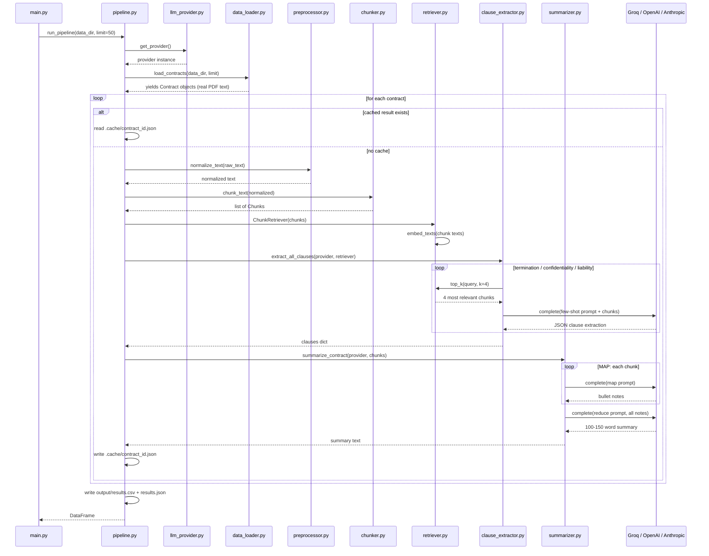
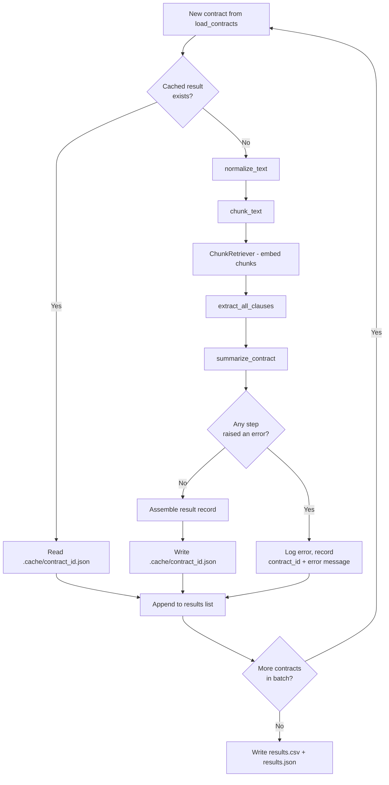

# Execution Diagrams

Companion to `docs/execution_walkthrough.md`. These render natively on GitHub
(no image export needed — just open this file in the repo).

## 1. Sequence diagram — who calls whom, in what order

This is the exact call order for processing one contract (the loop in
`run_pipeline()` repeats this per contract).

## 2. Decision flowchart — cache and error-handling logic

This is the branch logic inside the per-contract loop that the sequence
diagram glosses over.

The key thing this flowchart captures that the sequence diagram doesn't:
**one failed contract never stops the batch.** Step `I` catches any
exception from normalization, chunking, retrieval, extraction, or
summarization and routes to `J` instead of crashing — the contract just
shows up in the output with an `error` column filled in instead of a
summary.

## Why two diagrams instead of one

A single diagram trying to show both "call order" and "branch logic" gets
cluttered fast. Splitting them keeps each one answerable in one glance:

- **Sequence diagram** answers: *"what talks to what, and in what order?"*
  — the one to use when explaining the architecture.
- **Flowchart** answers: *"what happens if X fails, or Y is already cached?"*
  — the one to use when debugging or explaining resilience/reproducibility.
